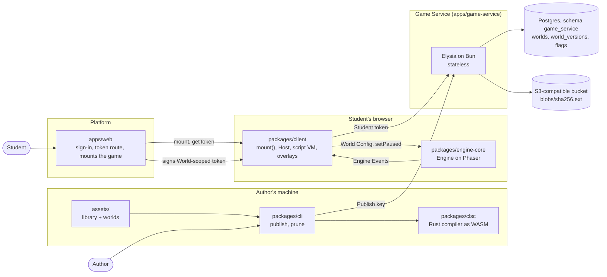

```mermaid
flowchart LR
  Author([Author])
  Student([Student])

  subgraph AuthorMachine["Author's machine"]
    Content["assets/<br/>library + worlds"]
    CLI["packages/cli<br/>publish, prune"]
    CLSC["packages/clsc<br/>Rust compiler as WASM"]
    Content --> CLI
    CLI --> CLSC
  end

  subgraph PlatformSide["Platform"]
    Web["apps/web<br/>sign-in, token route, mounts the game"]
  end

  subgraph Browser["Student's browser"]
    Client["packages/client<br/>mount(), Host, script VM, overlays"]
    Engine["packages/engine-core<br/>Engine on Phaser"]
    Client -->|"World Config, setPaused"| Engine
    Engine -->|"Engine Events"| Client
  end

  subgraph GameServiceSide["Game Service (apps/game-service)"]
    GS["Elysia on Bun<br/>stateless"]
  end

  PG[("Postgres, schema game_service<br/>worlds, world_versions, flags")]
  Bucket[("S3-compatible bucket<br/>blobs/sha256.ext")]

  Author --> CLI
  CLI -->|"Publish key"| GS
  Student --> Web
  Web -->|"mount, getToken"| Client
  Client -->|"Student token"| GS
  Web -->|"signs World-scoped token"| Client
  GS --> PG
  GS --> Bucket
```
