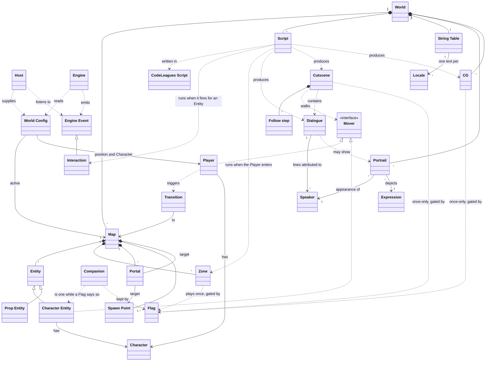

```mermaid
classDiagram
  class Host
  class Engine
  class WorldConfig["World Config"]
  class EngineEvent["Engine Event"]
  class Interaction
  class World
  class Map
  class Entity
  class CharacterEntity["Character Entity"]
  class PropEntity["Prop Entity"]
  class Mover {
    <<interface>>
  }
  class Player
  class Character
  class Companion
  class Zone
  class Portal
  class SpawnPoint["Spawn Point"]
  class Transition
  class Script
  class CodeLeaguesScript["CodeLeagues Script"]
  class Dialogue
  class Cutscene
  class FollowStep["Follow step"]
  class CG
  class Speaker
  class Portrait
  class Expression
  class StringTable["String Table"]
  class Locale
  class Flag

  Host ..> WorldConfig : supplies
  WorldConfig --> Map : active
  WorldConfig --> Player : position and Character
  Engine ..> WorldConfig : reads
  Engine ..> EngineEvent : emits
  EngineEvent <|-- Interaction
  Host ..> EngineEvent : listens to

  World "1" *-- "*" Map
  World "1" *-- "*" Script
  World "1" *-- "1" StringTable
  World "1" *-- "*" Portrait
  World "1" *-- "*" CG

  Map "1" *-- "*" Entity
  Map "1" *-- "*" Zone
  Map "1" *-- "*" Portal
  Map "1" *-- "1..*" SpawnPoint
  Portal --> Map : target
  Portal --> SpawnPoint : target
  Player ..> Transition : triggers
  Transition --> Map : to

  Entity <|-- CharacterEntity
  Entity <|-- PropEntity
  Mover <|.. Player
  Mover <|.. CharacterEntity
  Player --> Character : has
  CharacterEntity --> Character : has
  Companion ..> CharacterEntity : is one while a Flag says so
  Companion ..> Flag : kept by

  Script ..> CodeLeaguesScript : written in
  Script ..> Interaction : runs when it fires for an Entity
  Script ..> Zone : runs when the Player enters
  Script ..> Dialogue : produces
  Script ..> Cutscene : produces
  Script ..> CG : produces
  Cutscene *-- "*" FollowStep
  Cutscene ..> Mover : walks
  Cutscene ..> Dialogue : contains
  Zone ..> Flag : plays once, gated by
  Cutscene ..> Flag : once-only, gated by
  CG ..> Flag : once-only, gated by

  Dialogue "1" --> "*" Speaker : lines attributed to
  Dialogue ..> Portrait : may show
  Portrait "*" --> "1" Speaker : appearance of
  Portrait "*" --> "1" Expression : depicts
  StringTable "1" --> "*" Locale : one text per
```
