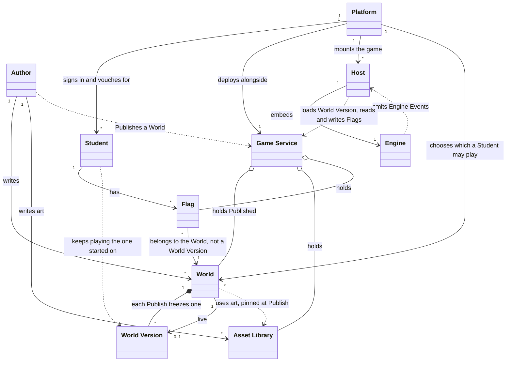

```mermaid
classDiagram
  class Platform
  class Student
  class Author
  class GameService["Game Service"]
  class Host
  class Engine
  class World
  class WorldVersion["World Version"]
  class AssetLibrary["Asset Library"]
  class Flag

  Platform "1" --> "*" Student : signs in and vouches for
  Platform "1" --> "1" GameService : deploys alongside
  Platform "1" --> "*" Host : mounts the game
  Platform "1" --> "*" World : chooses which a Student may play

  Host "1" --> "1" Engine : embeds
  Engine ..> Host : emits Engine Events
  Host ..> GameService : loads World Version, reads and writes Flags

  Author "1" --> "*" World : writes
  Author "1" --> "*" AssetLibrary : writes art
  Author ..> GameService : Publishes a World

  World "1" *-- "*" WorldVersion : each Publish freezes one
  World "1" --> "0..1" WorldVersion : live
  World ..> AssetLibrary : uses art, pinned at Publish

  Student "1" --> "*" Flag : has
  Flag "*" --> "1" World : belongs to the World, not a World Version
  Student ..> WorldVersion : keeps playing the one started on

  GameService o-- World : holds Published
  GameService o-- AssetLibrary : holds
  GameService o-- Flag : holds
```
