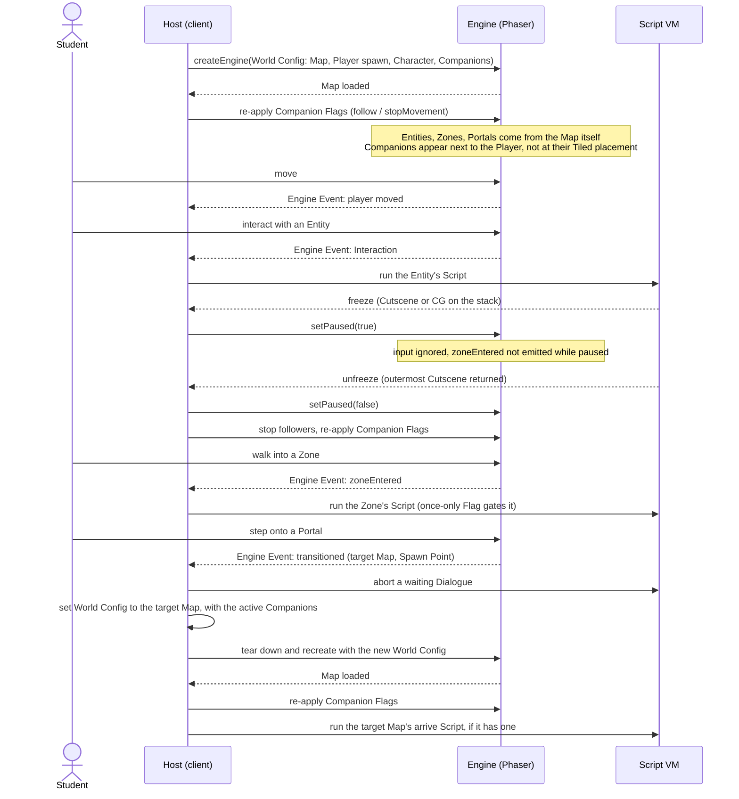

```mermaid
sequenceDiagram
  actor Student
  participant Host as Host (client)
  participant Engine as Engine (Phaser)
  participant VM as Script VM

  Host->>Engine: createEngine(World Config: Map, Player spawn, Character, Companions)
  Engine-->>Host: Map loaded
  Host->>Engine: re-apply Companion Flags (follow / stopMovement)
  Note over Engine: Entities, Zones, Portals come from the Map itself<br/>Companions appear next to the Player, not at their Tiled placement

  Student->>Engine: move
  Engine-->>Host: Engine Event: player moved
  Student->>Engine: interact with an Entity
  Engine-->>Host: Engine Event: Interaction
  Host->>VM: run the Entity's Script
  VM-->>Host: freeze (Cutscene or CG on the stack)
  Host->>Engine: setPaused(true)
  Note over Engine: input ignored, zoneEntered not emitted while paused
  VM-->>Host: unfreeze (outermost Cutscene returned)
  Host->>Engine: setPaused(false)
  Host->>Engine: stop followers, re-apply Companion Flags

  Student->>Engine: walk into a Zone
  Engine-->>Host: Engine Event: zoneEntered
  Host->>VM: run the Zone's Script (once-only Flag gates it)

  Student->>Engine: step onto a Portal
  Engine-->>Host: Engine Event: transitioned (target Map, Spawn Point)
  Host->>VM: abort a waiting Dialogue
  Host->>Host: set World Config to the target Map, with the active Companions
  Host->>Engine: tear down and recreate with the new World Config
  Engine-->>Host: Map loaded
  Host->>Engine: re-apply Companion Flags
  Host->>VM: run the target Map's arrive Script, if it has one
```
