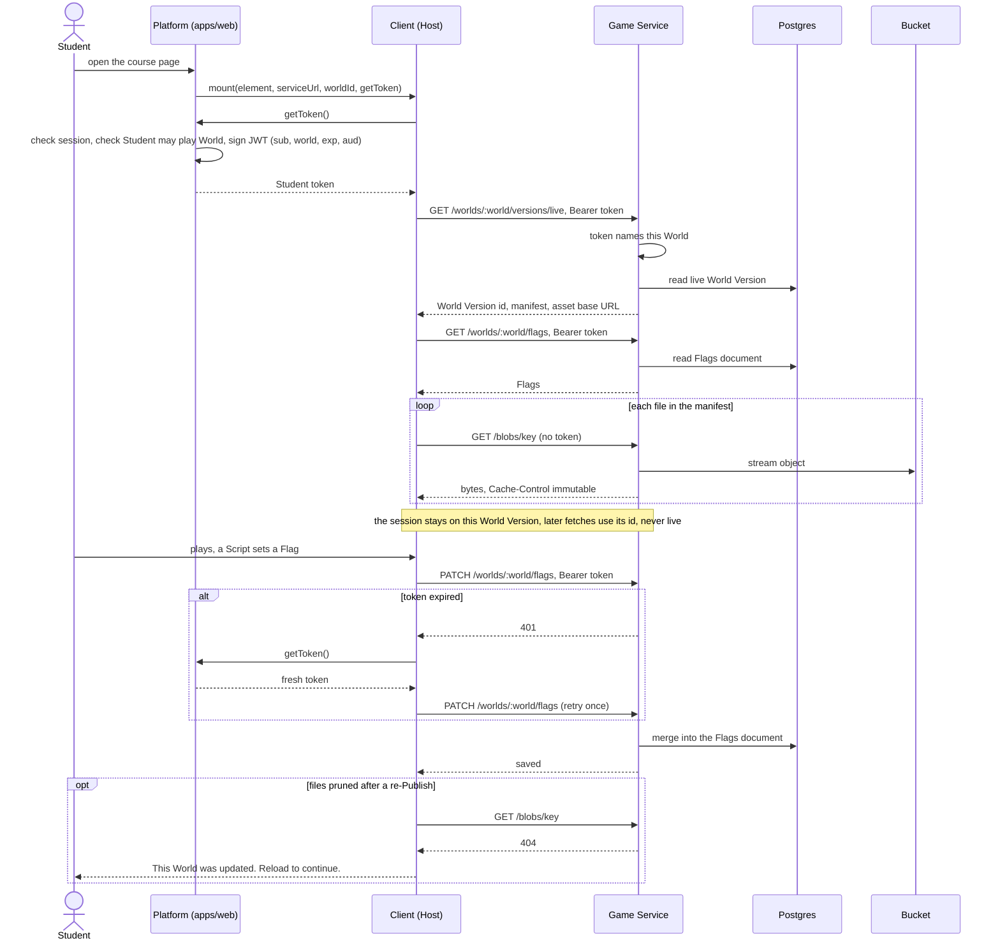

```mermaid
sequenceDiagram
  actor Student
  participant Platform as Platform (apps/web)
  participant Client as Client (Host)
  participant GS as Game Service
  participant PG as Postgres
  participant Bucket as Bucket

  Student->>Platform: open the course page
  Platform->>Client: mount(element, serviceUrl, worldId, getToken)
  Client->>Platform: getToken()
  Platform->>Platform: check session, check Student may play World, sign JWT (sub, world, exp, aud)
  Platform-->>Client: Student token
  Client->>GS: GET /worlds/:world/versions/live, Bearer token
  GS->>GS: token names this World
  GS->>PG: read live World Version
  GS-->>Client: World Version id, manifest, asset base URL
  Client->>GS: GET /worlds/:world/flags, Bearer token
  GS->>PG: read Flags document
  GS-->>Client: Flags
  loop each file in the manifest
    Client->>GS: GET /blobs/key (no token)
    GS->>Bucket: stream object
    GS-->>Client: bytes, Cache-Control immutable
  end
  Note over Client,GS: the session stays on this World Version, later fetches use its id, never live
  Student->>Client: plays, a Script sets a Flag
  Client->>GS: PATCH /worlds/:world/flags, Bearer token
  alt token expired
    GS-->>Client: 401
    Client->>Platform: getToken()
    Platform-->>Client: fresh token
    Client->>GS: PATCH /worlds/:world/flags (retry once)
  end
  GS->>PG: merge into the Flags document
  GS-->>Client: saved
  opt files pruned after a re-Publish
    Client->>GS: GET /blobs/key
    GS-->>Client: 404
    Client-->>Student: This World was updated. Reload to continue.
  end
```
