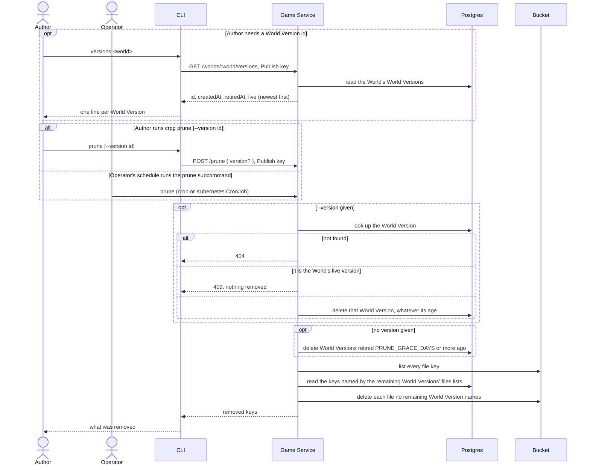

```mermaid
sequenceDiagram
  actor Author
  actor Operator
  participant CLI as CLI
  participant GS as Game Service
  participant PG as Postgres
  participant Bucket as Bucket

  opt Author needs a World Version id
    Author->>CLI: versions <world>
    CLI->>GS: GET /worlds/:world/versions, Publish key
    GS->>PG: read the World's World Versions
    GS-->>CLI: id, createdAt, retiredAt, live (newest first)
    CLI-->>Author: one line per World Version
  end
  alt Author runs crpg prune [--version id]
    Author->>CLI: prune [--version id]
    CLI->>GS: POST /prune { version? }, Publish key
  else Operator's schedule runs the prune subcommand
    Operator->>GS: prune (cron or Kubernetes CronJob)
  end
  opt --version given
    GS->>PG: look up the World Version
    alt not found
      GS-->>CLI: 404
    else it is the World's live version
      GS-->>CLI: 409, nothing removed
    else
      GS->>PG: delete that World Version, whatever its age
    end
  end
  opt no version given
    GS->>PG: delete World Versions retired PRUNE_GRACE_DAYS or more ago
  end
  GS->>Bucket: list every file key
  GS->>PG: read the keys named by the remaining World Versions' files lists
  GS->>Bucket: delete each file no remaining World Version names
  GS-->>CLI: removed keys
  CLI-->>Author: what was removed
```
