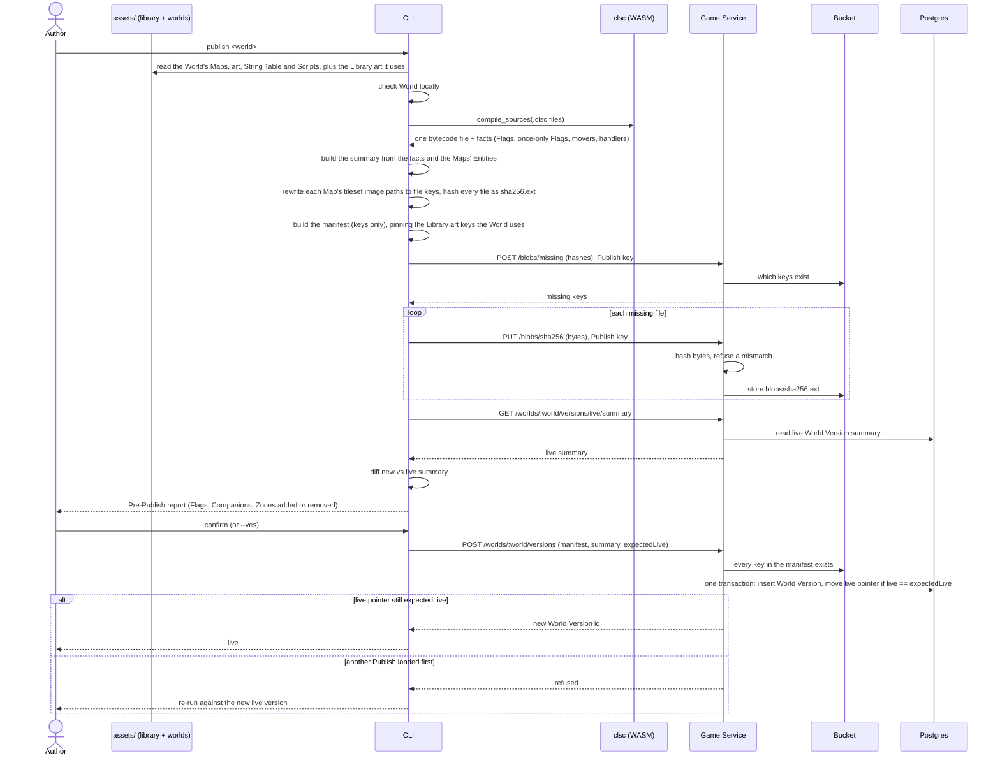

```mermaid
sequenceDiagram
  actor Author
  participant Assets as assets/ (library + worlds)
  participant CLI as CLI
  participant CLSC as clsc (WASM)
  participant GS as Game Service
  participant Bucket as Bucket
  participant PG as Postgres

  Author->>CLI: publish <world>
  CLI->>Assets: read the World's Maps, art, String Table and Scripts, plus the Library art it uses
  CLI->>CLI: check World locally
  CLI->>CLSC: compile_sources(.clsc files)
  CLSC-->>CLI: one bytecode file + facts (Flags, once-only Flags, movers, handlers)
  CLI->>CLI: build the summary from the facts and the Maps' Entities
  CLI->>CLI: rewrite each Map's tileset image paths to file keys, hash every file as sha256.ext
  CLI->>CLI: build the manifest (keys only), pinning the Library art keys the World uses
  CLI->>GS: POST /blobs/missing (hashes), Publish key
  GS->>Bucket: which keys exist
  GS-->>CLI: missing keys
  loop each missing file
    CLI->>GS: PUT /blobs/sha256 (bytes), Publish key
    GS->>GS: hash bytes, refuse a mismatch
    GS->>Bucket: store blobs/sha256.ext
  end
  CLI->>GS: GET /worlds/:world/versions/live/summary
  GS->>PG: read live World Version summary
  GS-->>CLI: live summary
  CLI->>CLI: diff new vs live summary
  CLI-->>Author: Pre-Publish report (Flags, Companions, Zones added or removed)
  Author->>CLI: confirm (or --yes)
  CLI->>GS: POST /worlds/:world/versions (manifest, summary, expectedLive)
  GS->>Bucket: every key in the manifest exists
  GS->>PG: one transaction: insert World Version, move live pointer if live == expectedLive
  alt live pointer still expectedLive
    GS-->>CLI: new World Version id
    CLI-->>Author: live
  else another Publish landed first
    GS-->>CLI: refused
    CLI-->>Author: re-run against the new live version
  end
```
