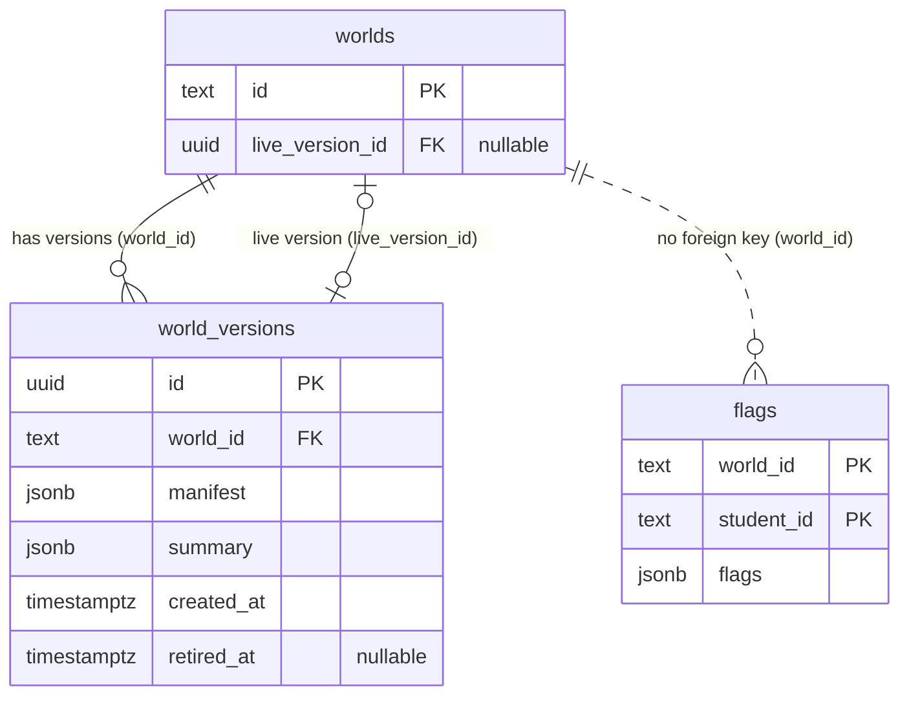

```mermaid
erDiagram
  worlds ||--o{ world_versions : "has versions (world_id)"
  worlds |o--o| world_versions : "live version (live_version_id)"
  worlds ||..o{ flags : "no foreign key (world_id)"

  worlds {
    text id PK
    uuid live_version_id FK "nullable"
  }
  world_versions {
    uuid id PK
    text world_id FK
    jsonb manifest
    jsonb summary
    timestamptz created_at
    timestamptz retired_at "nullable"
  }
  flags {
    text world_id PK
    text student_id PK
    jsonb flags
  }
```
