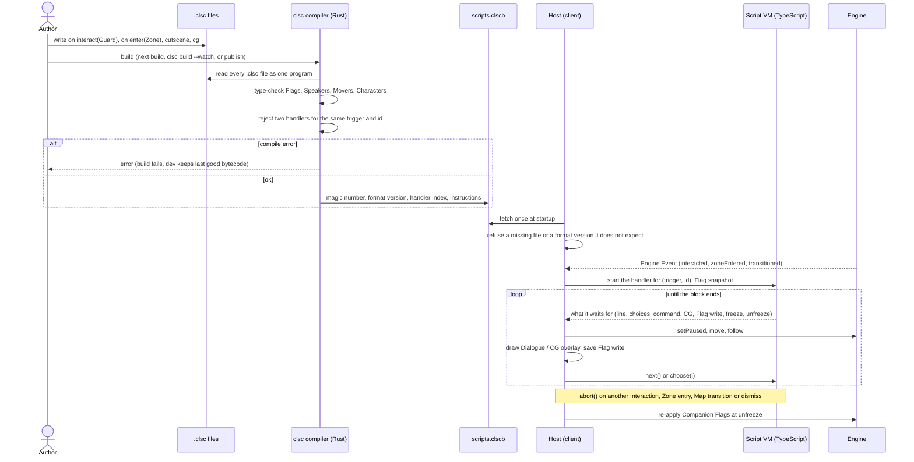

```mermaid
sequenceDiagram
  actor Author
  participant Src as .clsc files
  participant Compiler as clsc compiler (Rust)
  participant Bytecode as scripts.clscb
  participant Host as Host (client)
  participant VM as Script VM (TypeScript)
  participant Engine as Engine

  Author->>Src: write on interact(Guard), on enter(Zone), cutscene, cg
  Author->>Compiler: build (next build, clsc build --watch, or publish)
  Compiler->>Src: read every .clsc file as one program
  Compiler->>Compiler: type-check Flags, Speakers, Movers, Characters
  Compiler->>Compiler: reject two handlers for the same trigger and id
  alt compile error
    Compiler-->>Author: error (build fails, dev keeps last good bytecode)
  else ok
    Compiler->>Bytecode: magic number, format version, handler index, instructions
  end
  Host->>Bytecode: fetch once at startup
  Host->>Host: refuse a missing file or a format version it does not expect
  Engine-->>Host: Engine Event (interacted, zoneEntered, transitioned)
  Host->>VM: start the handler for (trigger, id), Flag snapshot
  loop until the block ends
    VM-->>Host: what it waits for (line, choices, command, CG, Flag write, freeze, unfreeze)
    Host->>Engine: setPaused, move, follow
    Host->>Host: draw Dialogue / CG overlay, save Flag write
    Host->>VM: next() or choose(i)
  end
  Note over Host,VM: abort() on another Interaction, Zone entry, Map transition or dismiss
  Host->>Engine: re-apply Companion Flags at unfreeze
```
